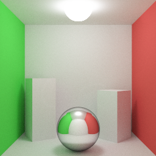

# Pathtracing

A CPU Monte Carlo pathtracer implemented in C++. Features:
- Spheres and triangle meshes
- KD-tree optimization for triangle meshes
- HDR output
- Textures and samplers
- Equirectangular maps (background)

## Building

This project uses [Premake](https://premake.github.io/) to build project files.

## Results

Room, 256x256 px, 64K spp